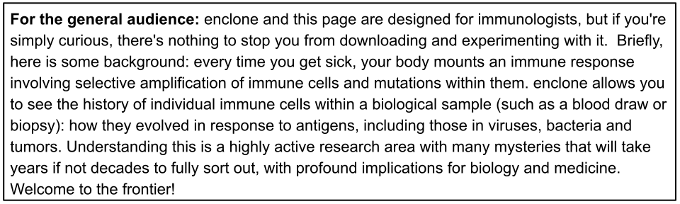

<a name="readme" style="display:block; position:relative; top:-150px;"></a>
# enclone


<br>
<br>
<br>

This site is under construction.  Please do not enter unless you have been directed here, and
are wearing proper safety equipment.  

(photo credit: NIOSH/wikipedia)

<br>
<br>
<br>
<br>

<b>enclone</b> is a computational tool for studying the adaptive immune system in humans and
other vertebrate species.  

It uses data from [10x Genomics](https://www.10xgenomics.com/) which permit the precise
characterization of individual immune cells.



## The mission of enclone

If you have a sample and have generated single-cell VDJ data from the B or T cells within it, you
have the power to fully understand the nature of the receptors for those cells, because you have
in hand the sequences for each of their chains.  

You should be able to directly see their biology, without aid from a computational expert.  To 
that end, we start with this simple goal:


The <i>finding</i> part is 
algorithmically challenging: it is very easy to mistakenly put unrelated cells in the same 
clonotype, and to "pollute" a clonotype with chains that do not belong there.
The <i>displaying</i> part is also challenging: we are unaware of other tools to do it.

<br>
<br>
<br>

To make sure we are using terminology in the same way, the following diagram shows what a 
_clonotype_ is for B cells.  The same applies for T cells, but things are simpler because T cells 
do not have somatic hypermutation.


Each cell in a clonotype is typically represented by two or three chains.  Such information can
only be obtained from _single cell_ data!  From such data, clonotypes can be computationally
approximated, with high accuracy (see below).  The method we use for this is described briefly in 
the online documentation for enclone, and will be described separately in more detail.


___________________________________________________________________________________________________

<a name="software" style="display:block; position:relative; top:-150px;"></a>
## The enclone software

enclone is open-source, beta software.  Binary executables for Linux and Mac can be 
directly downloaded from this page, as can sample 10x Genomics datasets.  And then you're off and
running!  To use enclone, you need to know how to run command-line tools.  This is something that 
can be learned easily, particularly if you have a friend or colleague who can help you
get started.  You do not need to be able to program, or anything of that sort.

enclone is fast, typically responding in seconds (if run on a single dataset).  It is intended 
as an experimental tool.  You can dynamically change your command line to select specific 
clonotypes and fields you wish to see.  You can run enclone on a laptop or a desktop or a server.

enclone is part of the [10x Genomics](https://www.10xgenomics.com/) immune 
profiling toolkit, including
[Cell Ranger and Loupe](https://support.10xgenomics.com/single-cell-gene-expression/software/overview/welcome), 
with which enclone will be integrated (later).
___________________________________________________________________________________________________

<a name="download" style="display:block; position:relative; top:-150px;"></a>
## How to download and install enclone and get test datasets

<b>(these instructions are not yet functional)</b>

<b>1.  Open terminal window.</b>  Open a terminal window on your Linux or Mac computer. Please let us
know if availability on other platforms is important to you.

<b>2.  Download enclone.</b>  Type the following to download the enclone executable:
```
mkdir -p ~/bin; cd ~/bin
wget https://github.com/10XDev/enclone/releases/download/latest/linux/enclone
or on a mac
wget https://github.com/10XDev/enclone/releases/download/latest/mac/enclone
```
This gets you the absolute latest version of enclone.  You can repeat this step if you ever
want to update.  At a later date, there will also be separately numbered releases that have passed 
a more extensive set of tests.

It is not necessary to compile enclone, unless you want to contribute
to the enclone codebase.  Please see [compilation](COMPILE.md).

<b>3.  Download test data.</b>  Type the following to download the enclone test datasets 
(and the source code, but you probably won't need that):
```
cd
git clone git@github.com:10XDev/enclone.git
```
At this point `~/enclone/datasets` will contain the datasets
that are prepackaged with enclone.  If you subsequently want to update this, do
```
cd ~/enclone
git pull
```
This assumes that you have not touched the repo since you first cloned it.  Otherwise you should
`git checkout master` first.

<b>4.  Update your path.</b>  Edit your shell initialization file to add `:~/bin` to `PATH`.  Ask a colleague for help
if needed.  Close and reopen your terminal window to refresh your path.  Then you're good to go!
___________________________________________________________________________________________________

## How to run enclone

Running enclone can be as simple as typing e.g. `enclone BCR=/home/my_name/experiment_123`
where the path is where your Cell Ranger outputs live, but there are many options to learn
about.  For example, if you want to combine many datasets, you can do that, but you probably
need to provide a metadata file that describes the datasets.  You can find most of the enclone
documentation within its online menus.  To get started you should:

1. Type `enclone help`, to make sure your terminal window works for `enclone`.

2. Type `enclone` to get to the main enclone help menu.

The concatenated help pages are also
[here](https://htmlpreview.github.io/?https://github.com/10XGenomics/enclone/blob/master/src/help.all.html) 
<b>[BROKEN LINK]</b>.  We may expand this out in the future to show the separate pages.
___________________________________________________________________________________________________

## How to understand enclone output

The example below shows how enclone prints out clonotypes.  This is something you'll need
to study in order to use enclone successfully.  enclone comes with extensive online 
documentation, and because you can easily play with the sample datasets, you can gradually
figure out how it all works.

 

This exact output would be obtained by typing
```
enclone PRE=~/enclone/datasets BCR=123085
```
provided that you put test data in the location indicated under download instructions.  Otherwise
you would need to change the value of `PRE`.  The directory `123085` is in the directory
`~/enclone/datasets` and contains some files from a Cell Ranger run, obtained from a human 
ovarian cancer sample.

By default, enclone prints clonotypes in this human-readable form.  You can also instruct enclone 
to print clonotypes in machine-readable forms that are suitable for input to other programs.
___________________________________________________________________________________________________

<a name="honeycomb" style="display:block; position:relative; top:-150px;"></a>
## How to display clonotypes produced by enclone


<br>

You can select clonotypes in enclone and then display them using a "honeycomb" plot.

In this instance, datasets from pre- and post-vaccination timepoints are displayed.  Clonotypes 
containing at least ten cells are shown.  The plot was generated by adding
```
MIN_CELLS=10 PLOT="clono.svg,pre->blue,post->red 
LEGEND=blue,"pre-vaccination cell",red,"post-vaccination cell"
```
to the enclone command line.  That caused `enclone` to generate the image as the file `clono.svg`.

<br><br><br><br><br><br>
___________________________________________________________________________________________________

## Questions

Please ask us questions!  We are greatly interested in your feedback and ideas you may have to 
make enclone as useful as possible.  You can write to us at enclone@10xgenomics.com.
Please note that enclone is beta software and is thus a work in progress.  We are actively
making many changes and may be unable to respond promptly to your particular request.
