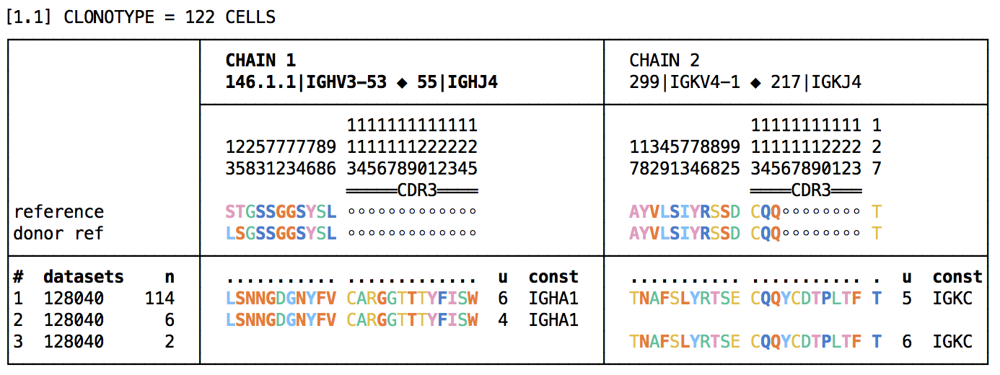
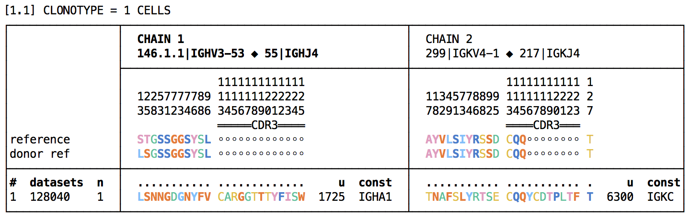
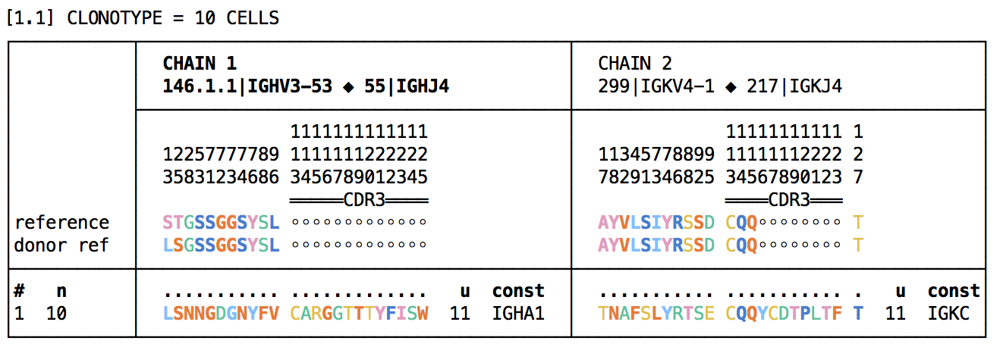
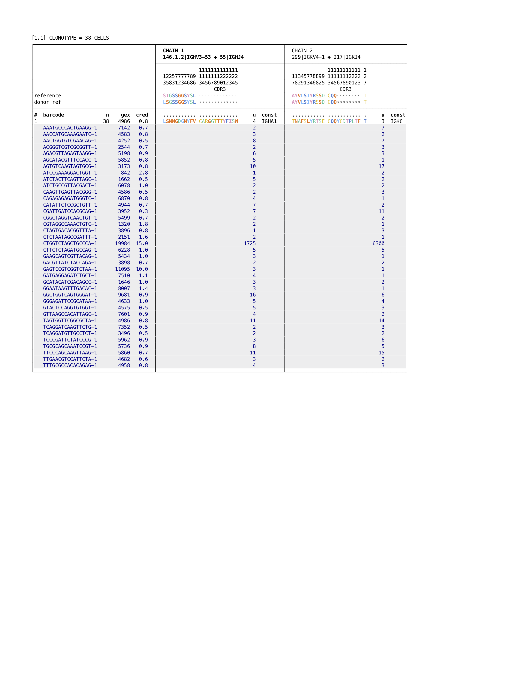

# Illusory clonotype expansions

The purpose of this page is to explain the origin of certain illusory clonotype expansions, and
which might result in incorrect scientific conclusions, and show how to detect them.

This illusory expansions are known to occur on occasion (see below for demonstration), and we
hypothesize that they arise when an individual cell disintegrates or leaks, leaving fragments that 
seed multiple GEM partitions in the 10x system, and thence yielding a clonotype which appears 
larger than its true size.

Events of this type are most likely with plasma or plasmablast B cells.

Disintegration might in principle occur during or after preparation of the sample.  One
way to document such an event would be to create two libraries from a single tube of cells.  If 
the clonotype is large and appears in only one of two libraries, one could be reasonably certain 
that a disintegration event occurred during or after cells were drawn from the tube.  This method 
could not be used to detect disintegration events occurring prior to that point.

Here we show that with the aid of gene expression data, illusory clonotype expansions can
generally be detected, even if only a single library was made, provided that the targetted
(B or T) cells are part of a mix of cell types (e.g. PBMCs).

We show an example, using two libraries obtained from a single tube of PBMC cells, obtained
from a healthy human donor.

```
enclone BCR=128037,128040 NCROSS
```

The `NCROSS` option instructs enclone to <i>not</i> filter out expanded clonotypes that appear
in only one dataset arising from the same sample.  Normally one would want this filtering, but
these clonotypes are exactly what we are trying to see here!  Here is the top clonotype:



If we do not use the `NCROSS` option, but search for the clonotype using the heavy chain
CDR3 sequence, we see just one cell:

```
enclone BCR=128037,128040 CDR3=CARGGTTTYFISW
```



Now suppose that both a VDJ and a GEX library have been made.

```
enclone BCR=128040 GEX=127801 CDR3=CARGGTTTYFISW
```



Now we see only ten cells.  This is because the default behavior of enclone is to filter out
cells called by the VDJ pipeline that are not also called by the GEX pipeline.

Now we add the option `PER_CELL`, so we can see data for each cell, and we also add two
fields to the display.  One is `gex`, the normalized count of gene expression UMIs,
and the other is a field `right`, that is more complicated.

```
enclone BCR=128040 GEX=127801 CDR3=CARGGTTTYFISW PER_CELL LVARSP=gex,right
```



To understand `right`, first let n be the number of VDJ cells that are also GEX cells.  Now for
a given cell, we find the n GEX cells that are closest to it in PCA space, and report the percent 
of those that are also VDJ cells.  This is `right`.  The closer this number is to 100, the more
the given cell looks like a typical B cell (or T cell, for TCR).  Conversely, a very low number
makes the given cell appears suspect, although it is not <i>proof</i> of such.

The values of `right` vary considerably from dataset to dataset.  We show the distribution for
<i>this</i> one:


| right  | % of B cells |
| -------| -------------|
|  0-20  |  5.4         |
| 20-40  |  2.9         |
| 40-60  |  2.1         |
| 60-80  |  4.7         |
| 80-100 | 84.9         |

Thus the values of the ten cells in the reported clonotype are very low indeed, and highly
suspect.  Probably the clonotype originated from a single cell, which broke up into a major
piece (the one for barcode `CTGGTCTAGCTGCCCA-1`), and many smaller pieces.
