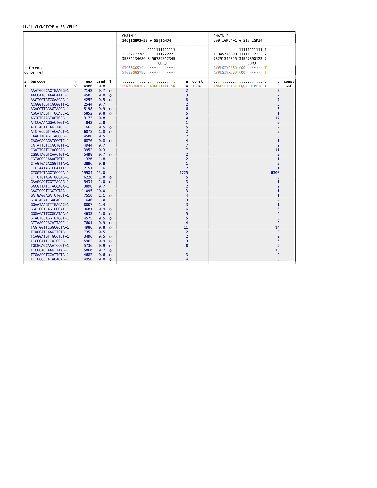

# Detecting illusory clonotype expansions

This page explains the origin of certain illusory clonotype expansions, and exhibits one example 
of how to detect them.

These expansions are known to occur occasionally (see below for one possible mechanism), and 
we hypothesize that they arise when an individual cell disintegrates or leaks. This leaves 
fragments that seed multiple GEM partitions, producing a clonotype that appears larger than 
its true size.

We believe that events of this type usually originate from plasma or plasmablast B cells.  We thus
focus on B cells in this vignette.  However with obvious changes, the same methods also apply to
T cells.

Disintegration might occur during or after preparation of the sample.  One
way to document such an event would be to create two libraries from a single tube of cells.  If 
the clonotype is large and appears in only one of two libraries, one could be reasonably certain 
that a disintegration event occurred during or after cells were drawn from the tube.  This method 
could not be used to detect disintegration events occurring prior to that point.

Here we show that with the aid of gene expression data, illusory clonotype expansions can
generally be detected, even if only a single library was made.  The easier case would be a sample
consisting of pure B cells.  The case where one has a mix of cell types is more challenging because 
a GEM can contain both a B cell fragment, plus a cell of a different type, and thus appear to have 
a normal level of gene expression, and no evidence of mixing from the VDJ assay either.  We 
therefore focus on the case of samples that contain a mixture of cell types.

To that end, we show an example, using two libraries obtained from a single tube of PBMC cells, 
obtained from a healthy human donor.  The two libraries contain 7287 and 9559 cells, respectively,
of which ~12% are B cells.  All the data shown here are part of the large dataset
package described in the [download section of the main enclone page](../README.md#download).

```
enclone BCR=128037,128040 NCROSS
```

The `NCROSS` option instructs enclone to <i>not</i> filter out expanded clonotypes that appear
in only one dataset arising from the same sample (and which based on their sizes are highly
improbable).  Normally one would want this filtering, but these clonotypes are exactly what we
wish to see now!  Here is the top clonotype:


If we do not use the `NCROSS` option, and search for the clonotype using the heavy chain
CDR3 sequence, we see just one cell (the others having been filtered out)

```
enclone BCR=128037,128040 CDR3=CARGGTTTYFISW
```


This is a good answer, but only works if libraries were made from two separate draws of cells.
Now suppose that both a VDJ and a GEX library have been made, from a single draw of cells.  (And
we henceforth ignore the data made from the other draw of cells, useful though it is.)

```
enclone BCR=128040 GEX=127801 CDR3=CARGGTTTYFISW
```


Now we see less cells.  This is because the default behavior of enclone is to filter out
cells called by the VDJ pipeline that are not also called by the GEX pipeline.  Most of these
would have consisted of "nearly empty drops", GEMs containing just a B cell fragment.

Now we add the option `PER_CELL`, causing data for each cell to be displayed, and we also add two
fields to the display.  One is `gex`, the normalized count of gene expression UMIs,
and the other is a field `cred` (short for "credibility"), that is more complicated.  We will also 
hide the onesie (single chain) cells.

```
enclone BCR=128040 GEX=127801 CDR3=CARGGTTTYFISW PER_CELL LVARSP=gex,cred MIN_CHAINS_EXACT=2
```


The field `cred` is a measure of the extent to which cells having gene expression similar to a
given putative B cell are themselves B cells.  In more detail, first for any datasets, let n be 
the number of VDJ cells that are also GEX cells.  Now for a given cell, we find the n GEX cells 
that are closest to it in PCA space, and report the percent of those that are also VDJ cells.  
This is `cred`.  The closer this number is to 100, the more the given cell looks like a typical 
B cell.  Conversely, a very low number makes the given cell appear suspect.

The values of `cred` vary considerably from dataset to dataset, requiring somewhat different
interpretation.  We show the distribution for this one dataset:


Thus the values of the cells in the reported clonotype are very low indeed, and almost all
highly suspect.  Probably the clonotype originated from a single cell, which broke up into one 
major piece (the one for barcode `CTGGTCTAGCTGCCCA-1`), and many smaller pieces.  These smaller 
pieces reside in GEMs that may or may not contain an actual intact cell.  In fact, many of the 
cells are detected as T cells (using TCR data `128024` from the same cell draw).  Using the `META` 
option for providing input to enclone, we can mark these cells in the same display:



We thus conclude in this case that the clonotype is likely contaminated with many cells that
are not B cells, and in fact that the entire clonotype probably arose from a single true B cell.
In other examples we have looked at, there appear to be a few true B 
cells, along with many that are not, either corresponding to other cell types or nearly empty GEMs.

<b> Overall conclusion: illusory clonotypes are rare, and can generally be detected, either with 
the aid of a second library made from the same lot of cells, or with gene expression data. </b>
